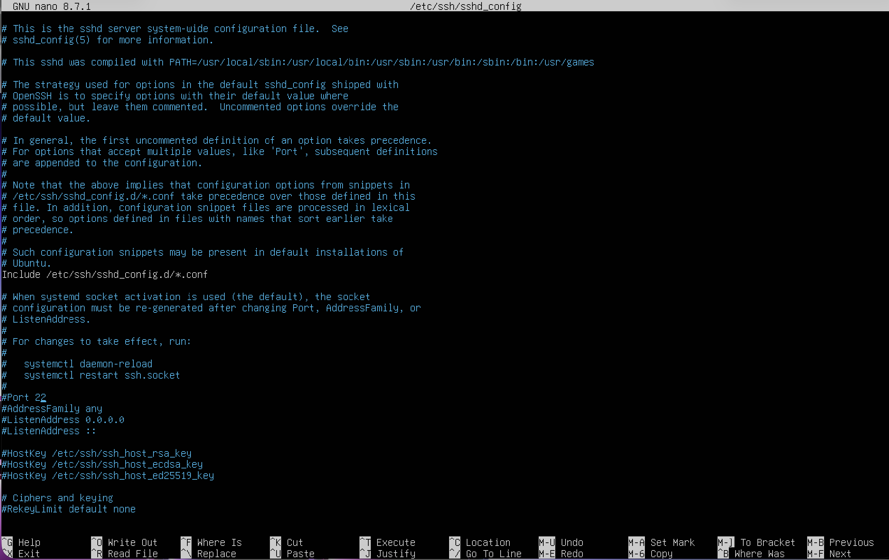
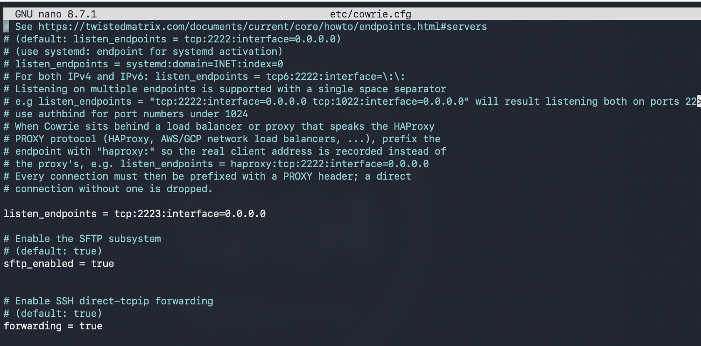
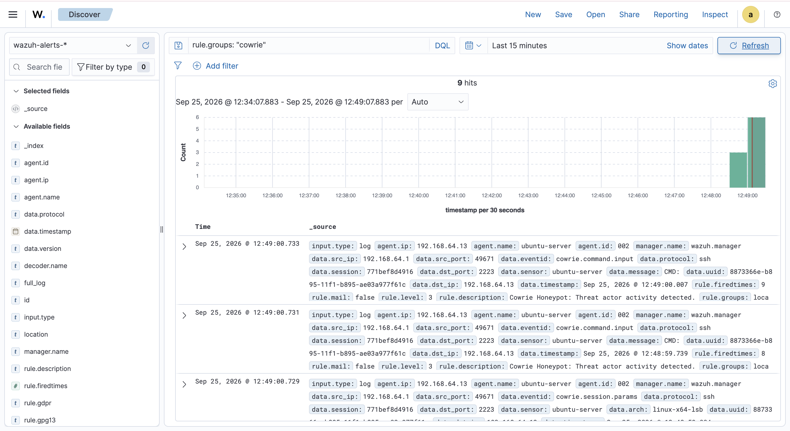

###Project: Deceptive Defense - Cowrie Honeypot & SIEM Integration

###Project Objective
The objective of this project was to deploy a production-grade Cowrie honeypot on an isolated ARM64 Ubuntu Server VM, simulate a brute-force SSH attack, and engineer a custom telemetry pipeline to ingest, parse, and visualize the threat actor's keystrokes inside a Wazuh SIEM.

##Technology Stack
- Hypervisor: UTM (ARM64 Virtualization)
- Operating Systems: Ubuntu Server 22.04 LTS
- Honeypot: Cowrie (High-interaction SSH/Telnet simulator)
- SIEM: Wazuh (Manager & Agent via Docker)
- Networking: iptables NAT port-forwarding, UFW

Methodology & Execution
##Phase 1: OS Hardening & Service Routing

To safely deploy a honeypot, the host machine's actual SSH service must be protected. I modified the sshd_config file to move the real SSH daemon from the default Port 22 to Port 2222, locking down remote administrative access.

##Phase 2: Honeypot Deployment & Traffic Redirection
I created an unprivileged cowrie user account and deployed the Cowrie honeypot environment within an isolated Python virtual environment. The honeypot was configured via cowrie.cfg to listen on Port 2223. Using iptables, I instituted a PREROUTING NAT rule to forcefully redirect all inbound traffic targeting Port 22 directly into the honeypot on Port 2223.

##Phase 3: Live Fire Attack Simulation
Operating from a separate attacking machine, I targeted the honeypot's IP address on the standard SSH port (Port 22). The iptables rule successfully captured the traffic and routed me into the deceptive Cowrie environment. I executed unauthorized reconnaissance commands (whoami, ls -la) which the honeypot silently recorded.

##Phase 4: Forensic Telemetry Generation
Cowrie actively monitors the compromised session and generates structured JSON logs of all threat actor activity. I validated the local log generation pipeline by inspecting cowrie.json, confirming that the simulated attacker's IP, session ID, and specific keystrokes were successfully captured at the infrastructure level.

##Phase 5: SIEM Ingestion & XML Rule Engineering
To translate raw logs into actionable intelligence, I configured a Wazuh Agent to monitor the cowrie.json file and ship it over TCP/1514 to the containerized Wazuh Manager. With the pipeline stabilized, the SIEM successfully ingested the logs, matched them against the custom cowrie rule group, and visualized the exact commands executed by the attacker in the Discover dashboard.
# cowrie-honeypot-lab
